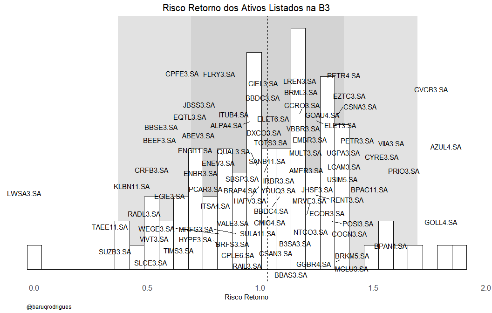

<!-- README.md is generated from README.Rmd. Please edit that file -->

# Análise CAPM

<!-- badges: start -->
<!-- badges: end -->

## Explicando o repositório

Nesse repositório contém alguns scripts que eu fiz enquanto estudava
Modern Portfolio Theory. Como não terminei de estudar, volta e meia vou
atualizar esse repositório. No momento ele só tem uma análise CAPM que
fiz para alguns ativos da B3, a análise tem apenas sentido pedagógico e
não deve ser levada a sério.

Caso você tenha interesse nos dados da B3 e não tenha expertise em R
execute o Script atualizacao_capm. Ele irá gerar um objetvo chamado
retorno_ativos, com ele você pode fazer sua análise.

## Um breve resumo sobre Modelos de Precificação de Ativos de Capital - CAPM

Desde Markowitz (1959) investidores que tem maior aversão ao risco
preferem carteiras de investimento fazendo um trade off entre risco e o
retorno no período, onde buscam compor carteiras que promovam o maior
retorno possível dada a minimização risco.

O modelo de CAPM foi proposto por Sharpe (1964), é um modelo de fator
único, que considera apenas o risco sistêmico, e um dos modelos mais
populares para a precificação de ativos, já que busca explicar a relação
entre o retorno esperado do ativo e a incerteza do retorno do
investimento.

Um dos pontos chaves do modelo CAPM é saber o quanto um ativo premia de
lucro em relação a taxa livre de risco. Para o Mercado Brasileiro
utilizamos como taxa livre de risco a taxa SELIC, que registra a
taxaédia ofertada pelos títulos públicos brasileiros. De forma mais
simples, queremos entender o quão melhor é um ativo em relação ao
investimento mais seguro disponível no mercado. Se o retorno do ativo
pagar muito mais que a SELIC ele vale o investimento.

## Análise dos Resultados

Na tabela abaixo calculamos o risco-retorno dos ativos da B3. Para o
coeficiente através de um modelo de regressão linear onde o parametro B1
é o ativo - selic e o B2 é o bovespa - selic.

    #> 
    #> Attaching package: 'dplyr'
    #> The following objects are masked from 'package:stats':
    #> 
    #>     filter, lag
    #> The following objects are masked from 'package:base':
    #> 
    #>     intersect, setdiff, setequal, union

<table class="gt_table">
  <thead class="gt_header">
    <tr>
      <th colspan="2" class="gt_heading gt_title gt_font_normal gt_bottom_border" style>Retorno Esperado dos Ativos da B3</th>
    </tr>
    
  </thead>
  <thead class="gt_col_headings">
    <tr>
      <th class="gt_col_heading gt_columns_bottom_border gt_left" rowspan="1" colspan="1">Ativo</th>
      <th class="gt_col_heading gt_columns_bottom_border gt_right" rowspan="1" colspan="1">Retorno Esperado</th>
    </tr>
  </thead>
  <tbody class="gt_table_body">
    <tr><td class="gt_row gt_left">LWSA3.SA</td>
<td class="gt_row gt_right">&minus;0.01</td></tr>
    <tr><td class="gt_row gt_left">TAEE11.SA</td>
<td class="gt_row gt_right">0.38</td></tr>
    <tr><td class="gt_row gt_left">SUZB3.SA</td>
<td class="gt_row gt_right">0.40</td></tr>
    <tr><td class="gt_row gt_left">SLCE3.SA</td>
<td class="gt_row gt_right">0.47</td></tr>
    <tr><td class="gt_row gt_left">VIVT3.SA</td>
<td class="gt_row gt_right">0.49</td></tr>
    <tr><td class="gt_row gt_left">KLBN11.SA</td>
<td class="gt_row gt_right">0.49</td></tr>
    <tr><td class="gt_row gt_left">RADL3.SA</td>
<td class="gt_row gt_right">0.53</td></tr>
    <tr><td class="gt_row gt_left">EGIE3.SA</td>
<td class="gt_row gt_right">0.55</td></tr>
    <tr><td class="gt_row gt_left">CRFB3.SA</td>
<td class="gt_row gt_right">0.56</td></tr>
    <tr><td class="gt_row gt_left">BEEF3.SA</td>
<td class="gt_row gt_right">0.64</td></tr>
    <tr><td class="gt_row gt_left">ENBR3.SA</td>
<td class="gt_row gt_right">0.65</td></tr>
    <tr><td class="gt_row gt_left">BBSE3.SA</td>
<td class="gt_row gt_right">0.65</td></tr>
    <tr><td class="gt_row gt_left">TIMS3.SA</td>
<td class="gt_row gt_right">0.68</td></tr>
    <tr><td class="gt_row gt_left">PCAR3.SA</td>
<td class="gt_row gt_right">0.70</td></tr>
    <tr><td class="gt_row gt_left">CPFE3.SA</td>
<td class="gt_row gt_right">0.71</td></tr>
    <tr><td class="gt_row gt_left">ABEV3.SA</td>
<td class="gt_row gt_right">0.73</td></tr>
    <tr><td class="gt_row gt_left">EQTL3.SA</td>
<td class="gt_row gt_right">0.74</td></tr>
    <tr><td class="gt_row gt_left">FLRY3.SA</td>
<td class="gt_row gt_right">0.76</td></tr>
    <tr><td class="gt_row gt_left">ENGI11.SA</td>
<td class="gt_row gt_right">0.78</td></tr>
    <tr><td class="gt_row gt_left">JBSS3.SA</td>
<td class="gt_row gt_right">0.79</td></tr>
    <tr><td class="gt_row gt_left">HYPE3.SA</td>
<td class="gt_row gt_right">0.82</td></tr>
    <tr><td class="gt_row gt_left">WEGE3.SA</td>
<td class="gt_row gt_right">0.83</td></tr>
    <tr><td class="gt_row gt_left">ENEV3.SA</td>
<td class="gt_row gt_right">0.85</td></tr>
    <tr><td class="gt_row gt_left">BRAP4.SA</td>
<td class="gt_row gt_right">0.86</td></tr>
    <tr><td class="gt_row gt_left">ITSA4.SA</td>
<td class="gt_row gt_right">0.87</td></tr>
    <tr><td class="gt_row gt_left">CPLE6.SA</td>
<td class="gt_row gt_right">0.89</td></tr>
    <tr><td class="gt_row gt_left">MRFG3.SA</td>
<td class="gt_row gt_right">0.90</td></tr>
    <tr><td class="gt_row gt_left">BRFS3.SA</td>
<td class="gt_row gt_right">0.93</td></tr>
    <tr><td class="gt_row gt_left">ITUB4.SA</td>
<td class="gt_row gt_right">0.93</td></tr>
    <tr><td class="gt_row gt_left">SBSP3.SA</td>
<td class="gt_row gt_right">0.96</td></tr>
    <tr><td class="gt_row gt_left">ALPA4.SA</td>
<td class="gt_row gt_right">0.96</td></tr>
    <tr><td class="gt_row gt_left">TOTS3.SA</td>
<td class="gt_row gt_right">0.96</td></tr>
    <tr><td class="gt_row gt_left">VALE3.SA</td>
<td class="gt_row gt_right">0.96</td></tr>
    <tr><td class="gt_row gt_left">SULA11.SA</td>
<td class="gt_row gt_right">0.97</td></tr>
    <tr><td class="gt_row gt_left">CMIG4.SA</td>
<td class="gt_row gt_right">0.98</td></tr>
    <tr><td class="gt_row gt_left">QUAL3.SA</td>
<td class="gt_row gt_right">0.98</td></tr>
    <tr><td class="gt_row gt_left">RAIL3.SA</td>
<td class="gt_row gt_right">0.99</td></tr>
    <tr><td class="gt_row gt_left">HAPV3.SA</td>
<td class="gt_row gt_right">1.00</td></tr>
    <tr><td class="gt_row gt_left">DXCO3.SA</td>
<td class="gt_row gt_right">1.01</td></tr>
    <tr><td class="gt_row gt_left">SANB11.SA</td>
<td class="gt_row gt_right">1.02</td></tr>
    <tr><td class="gt_row gt_left">CSAN3.SA</td>
<td class="gt_row gt_right">1.02</td></tr>
    <tr><td class="gt_row gt_left">CIEL3.SA</td>
<td class="gt_row gt_right">1.06</td></tr>
    <tr><td class="gt_row gt_left">B3SA3.SA</td>
<td class="gt_row gt_right">1.07</td></tr>
    <tr><td class="gt_row gt_left">ELET6.SA</td>
<td class="gt_row gt_right">1.08</td></tr>
    <tr><td class="gt_row gt_left">BBDC4.SA</td>
<td class="gt_row gt_right">1.09</td></tr>
    <tr><td class="gt_row gt_left">BBDC3.SA</td>
<td class="gt_row gt_right">1.09</td></tr>
    <tr><td class="gt_row gt_left">VBBR3.SA</td>
<td class="gt_row gt_right">1.10</td></tr>
    <tr><td class="gt_row gt_left">LREN3.SA</td>
<td class="gt_row gt_right">1.13</td></tr>
    <tr><td class="gt_row gt_left">BRML3.SA</td>
<td class="gt_row gt_right">1.14</td></tr>
    <tr><td class="gt_row gt_left">MULT3.SA</td>
<td class="gt_row gt_right">1.15</td></tr>
    <tr><td class="gt_row gt_left">IRBR3.SA</td>
<td class="gt_row gt_right">1.16</td></tr>
    <tr><td class="gt_row gt_left">GGBR4.SA</td>
<td class="gt_row gt_right">1.17</td></tr>
    <tr><td class="gt_row gt_left">YDUQ3.SA</td>
<td class="gt_row gt_right">1.17</td></tr>
    <tr><td class="gt_row gt_left">JHSF3.SA</td>
<td class="gt_row gt_right">1.17</td></tr>
    <tr><td class="gt_row gt_left">CCRO3.SA</td>
<td class="gt_row gt_right">1.17</td></tr>
    <tr><td class="gt_row gt_left">BBAS3.SA</td>
<td class="gt_row gt_right">1.18</td></tr>
    <tr><td class="gt_row gt_left">NTCO3.SA</td>
<td class="gt_row gt_right">1.19</td></tr>
    <tr><td class="gt_row gt_left">GOAU4.SA</td>
<td class="gt_row gt_right">1.19</td></tr>
    <tr><td class="gt_row gt_left">MRVE3.SA</td>
<td class="gt_row gt_right">1.20</td></tr>
    <tr><td class="gt_row gt_left">AMER3.SA</td>
<td class="gt_row gt_right">1.23</td></tr>
    <tr><td class="gt_row gt_left">RENT3.SA</td>
<td class="gt_row gt_right">1.24</td></tr>
    <tr><td class="gt_row gt_left">ELET3.SA</td>
<td class="gt_row gt_right">1.24</td></tr>
    <tr><td class="gt_row gt_left">EMBR3.SA</td>
<td class="gt_row gt_right">1.27</td></tr>
    <tr><td class="gt_row gt_left">USIM5.SA</td>
<td class="gt_row gt_right">1.27</td></tr>
    <tr><td class="gt_row gt_left">ECOR3.SA</td>
<td class="gt_row gt_right">1.28</td></tr>
    <tr><td class="gt_row gt_left">LCAM3.SA</td>
<td class="gt_row gt_right">1.30</td></tr>
    <tr><td class="gt_row gt_left">POSI3.SA</td>
<td class="gt_row gt_right">1.31</td></tr>
    <tr><td class="gt_row gt_left">PETR4.SA</td>
<td class="gt_row gt_right">1.33</td></tr>
    <tr><td class="gt_row gt_left">BRKM5.SA</td>
<td class="gt_row gt_right">1.33</td></tr>
    <tr><td class="gt_row gt_left">MGLU3.SA</td>
<td class="gt_row gt_right">1.33</td></tr>
    <tr><td class="gt_row gt_left">CSNA3.SA</td>
<td class="gt_row gt_right">1.34</td></tr>
    <tr><td class="gt_row gt_left">EZTC3.SA</td>
<td class="gt_row gt_right">1.35</td></tr>
    <tr><td class="gt_row gt_left">COGN3.SA</td>
<td class="gt_row gt_right">1.35</td></tr>
    <tr><td class="gt_row gt_left">UGPA3.SA</td>
<td class="gt_row gt_right">1.37</td></tr>
    <tr><td class="gt_row gt_left">PETR3.SA</td>
<td class="gt_row gt_right">1.39</td></tr>
    <tr><td class="gt_row gt_left">BPAC11.SA</td>
<td class="gt_row gt_right">1.39</td></tr>
    <tr><td class="gt_row gt_left">CYRE3.SA</td>
<td class="gt_row gt_right">1.47</td></tr>
    <tr><td class="gt_row gt_left">VIIA3.SA</td>
<td class="gt_row gt_right">1.53</td></tr>
    <tr><td class="gt_row gt_left">BPAN4.SA</td>
<td class="gt_row gt_right">1.53</td></tr>
    <tr><td class="gt_row gt_left">PRIO3.SA</td>
<td class="gt_row gt_right">1.59</td></tr>
    <tr><td class="gt_row gt_left">CVCB3.SA</td>
<td class="gt_row gt_right">1.71</td></tr>
    <tr><td class="gt_row gt_left">GOLL4.SA</td>
<td class="gt_row gt_right">1.84</td></tr>
    <tr><td class="gt_row gt_left">AZUL4.SA</td>
<td class="gt_row gt_right">1.87</td></tr>
  </tbody>
  
  
</table>

No Gráfico abaixo plotamos a visualização do risco retorno dos ativos
listados na B3. As áreas em cinza demonstram os desvios padrão. A linha
tracejada indica a média.

    #> `stat_bin()` using `bins = 30`. Pick better value with `binwidth`.

<!-- -->
